# The Requirment was to draw a full Robot:

## First we designed the robot to be like a human:

### The steps of drawing:

1. body
2. shoulders.
3. Arms. (left and right)
4. Arms' Fingers
5. Legs. (Left and rigth) 
6. Feet.
 

> and we got the design as showm:

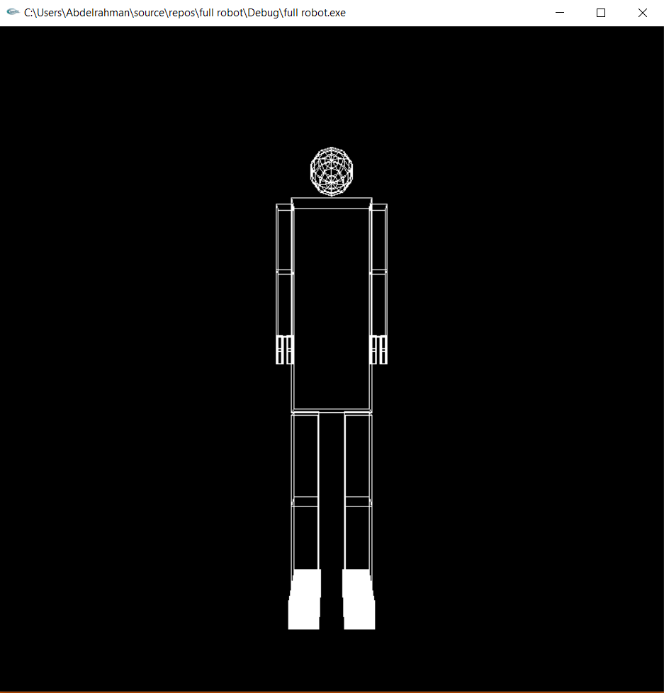

## Then starting the animations of all parts of the body:

1. The arms:

 

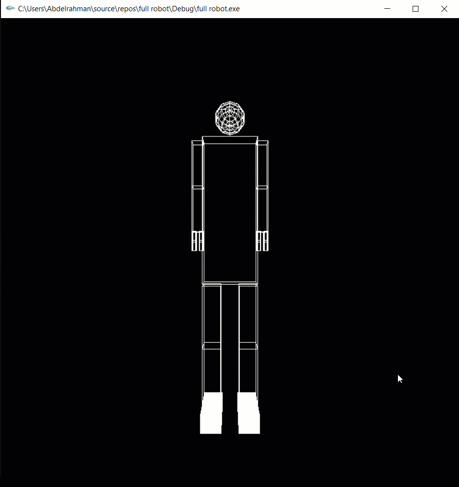

 

2. The Legs:

 

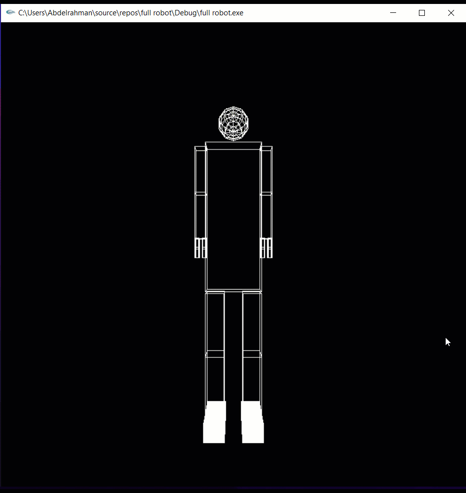

 

3. The Knees:

 

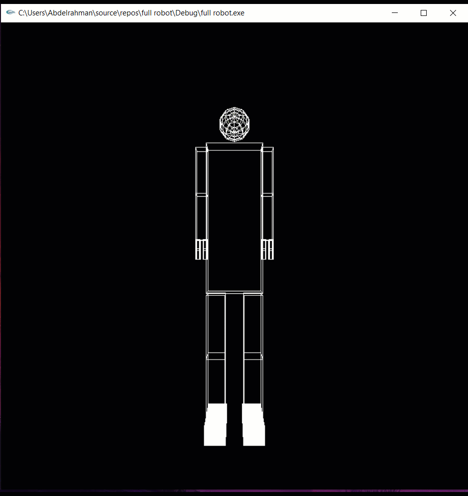

 

4. The Feet:

 

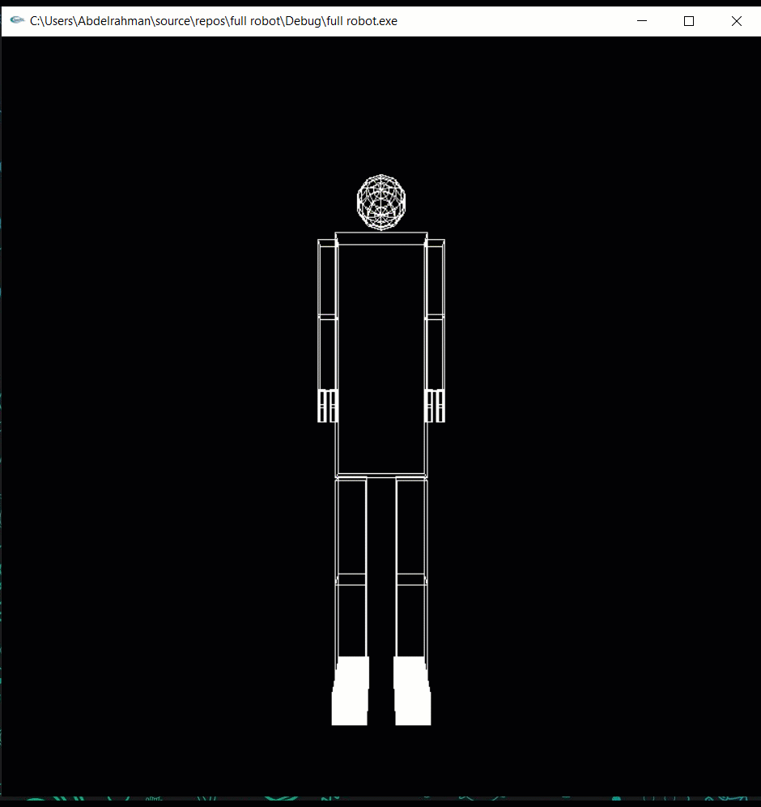

 

5. vision directions (Left, Right, Up, down):

 

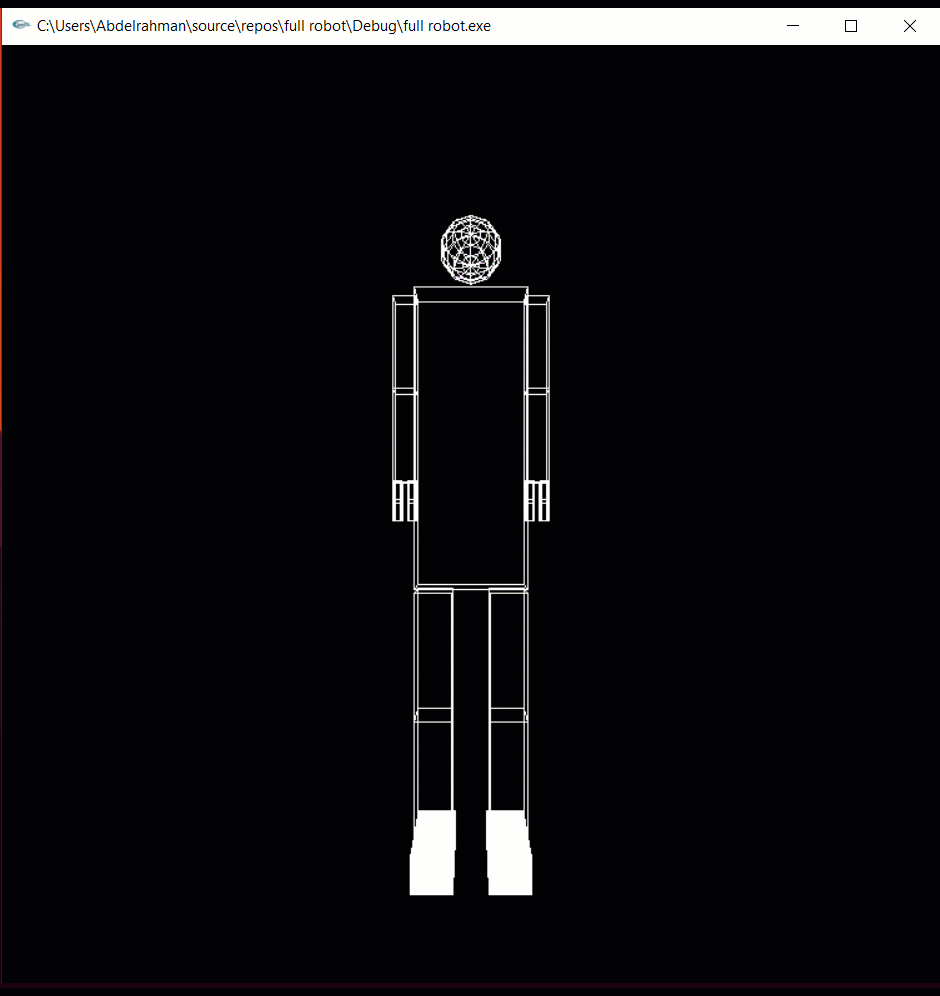

 

6. Camera Forward and Backword:

 

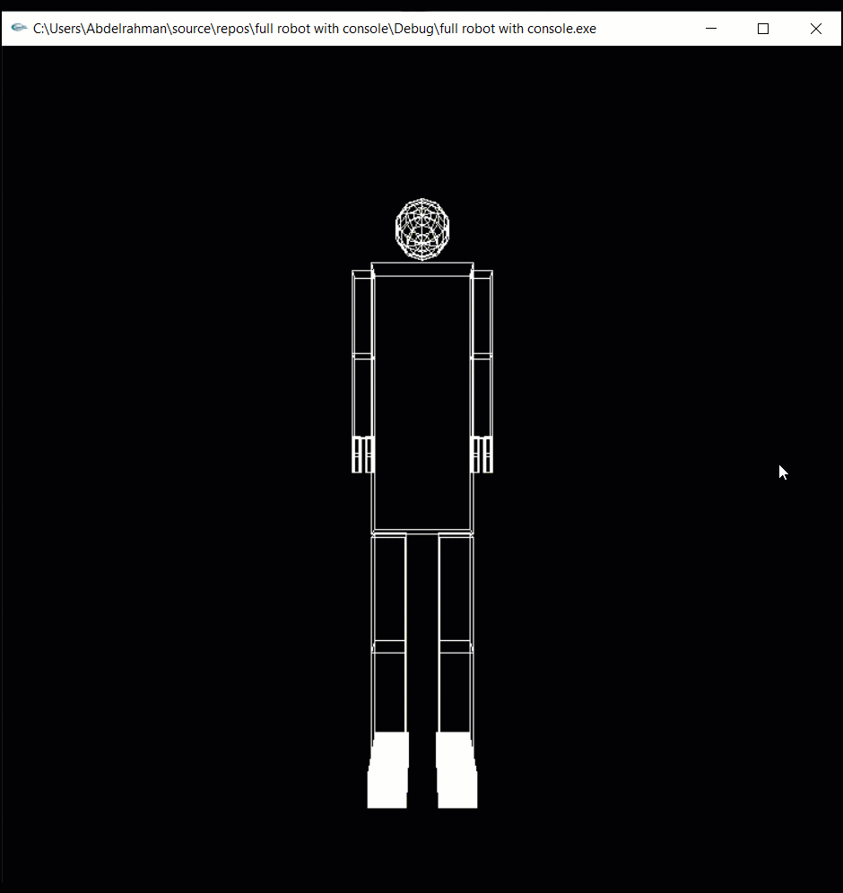

 

Here are the shortcuts for movements

| Key |             Action             |
|:---:|:------------------------------:|
|  <kbd>0</kbd> | Reset |
|  <kbd>+</kbd> | Forward |
| <kbd>-</kbd>  |  Backward |
<kbd>&larr;</kbd>| Turn Left |
|  <kbd>&rarr;</kbd>|  Turn Right|  
|  <kbd>&uarr;</kbd> | Turn Up |
| <kbd>&darr;</kbd>  |  Turn Down | 
|  <kbd>a</kbd> & <kbd>A</kbd> | Right Arm |
|  <kbd>w</kbd> & <kbd>W</kbd> | Right elbow |
|  <kbd>s</kbd> & <kbd>S</kbd> | Left arm |
|  <kbd>e</kbd> & <kbd>E</kbd> | Left elbow |
|  <kbd>z</kbd> & <kbd>Z</kbd> | Right knee rotation about x axis |
|  <kbd>r</kbd> & <kbd>R</kbd> | Right knee rotation about z axis |
|  <kbd>x</kbd> & <kbd>X</kbd> | Right leg rotation about x axis |
|  <kbd>d</kbd> & <kbd>D</kbd> | Right leg rotation about z axis |
|  <kbd>n</kbd> & <kbd>N</kbd> | Right Foot|
|  <kbd>v</kbd> & <kbd>V</kbd> | Left knee rotation about x axis|
|  <kbd>t</kbd> & <kbd>T</kbd> | Left knee rotation about z axis |
|  <kbd>c</kbd> & <kbd>C</kbd> | Left leg rotation about x axis |
|  <kbd>f</kbd> & <kbd>F</kbd> | Left leg rotation about z axis|
|  <kbd>m</kbd> & <kbd>M</kbd> | left Foot|

## Here is final Imgs of the project:

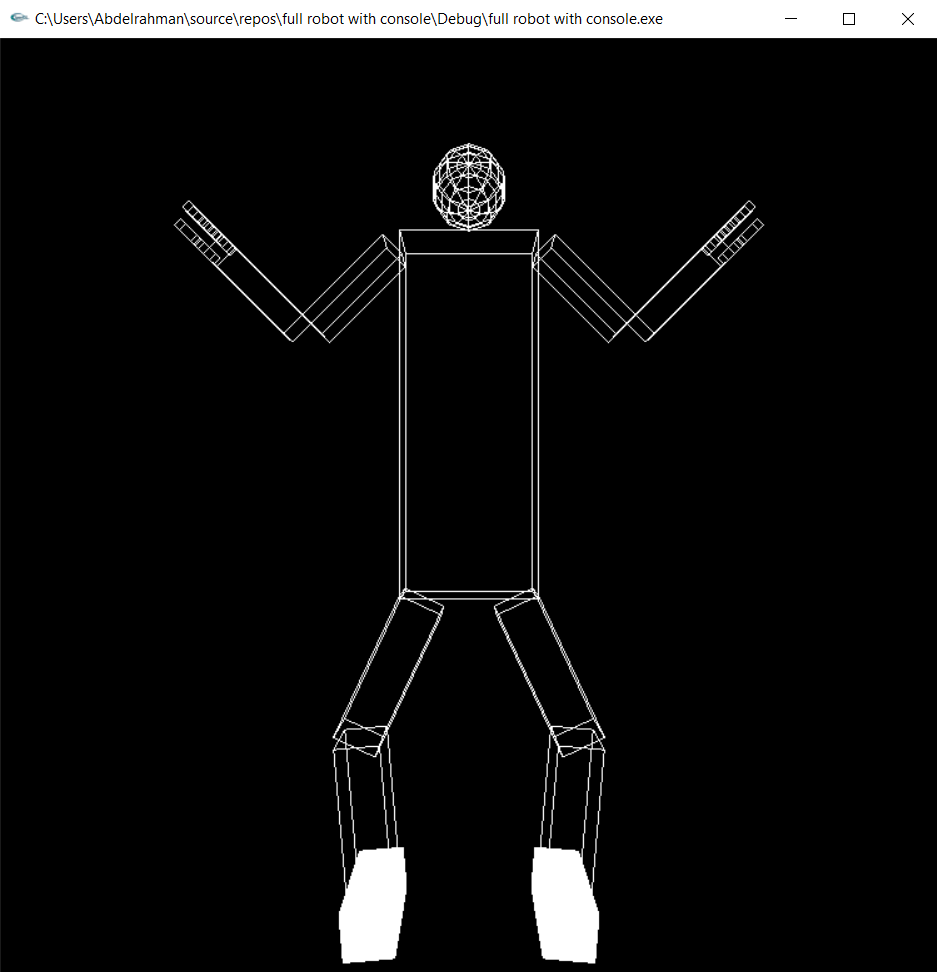

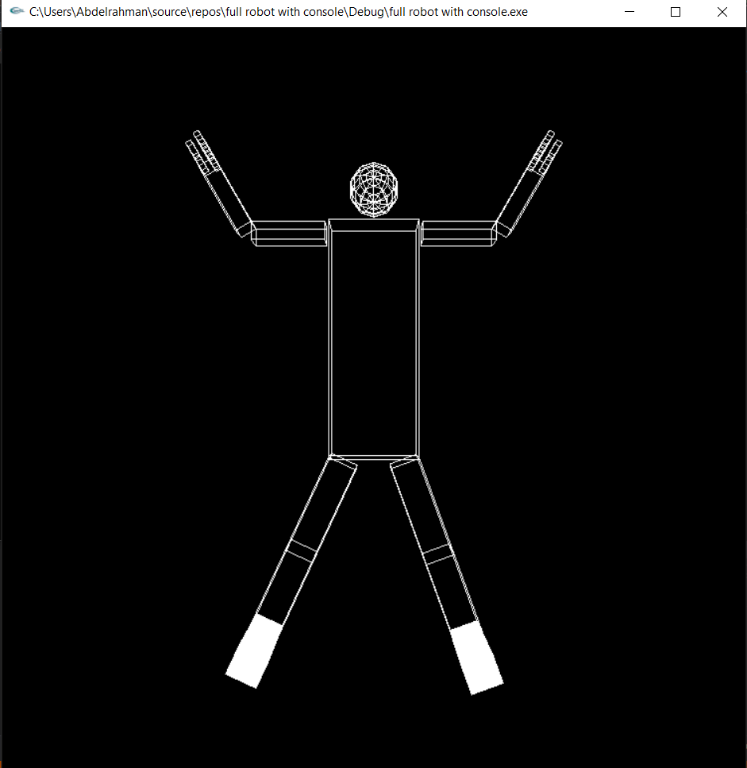

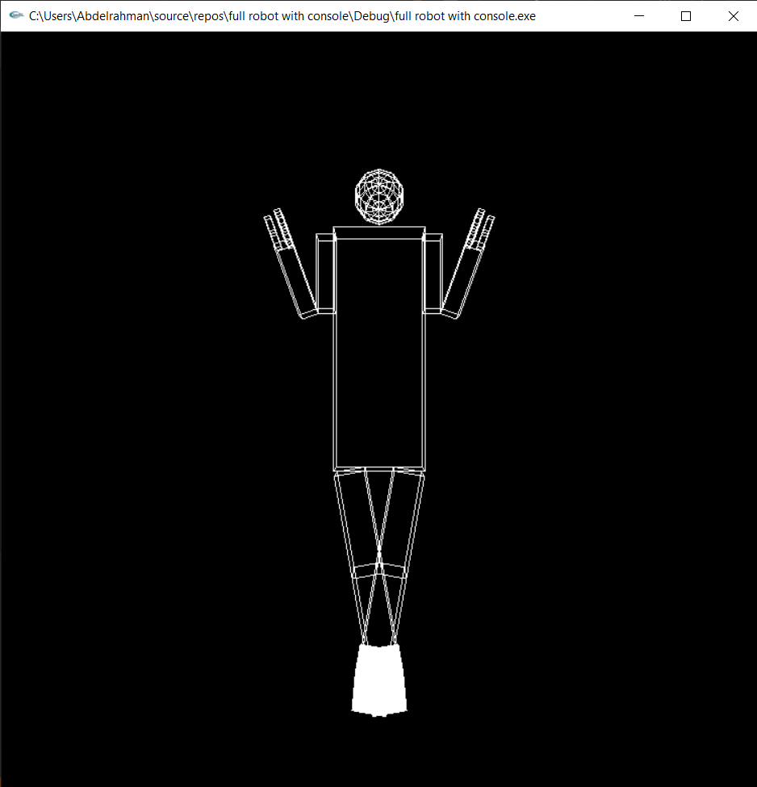

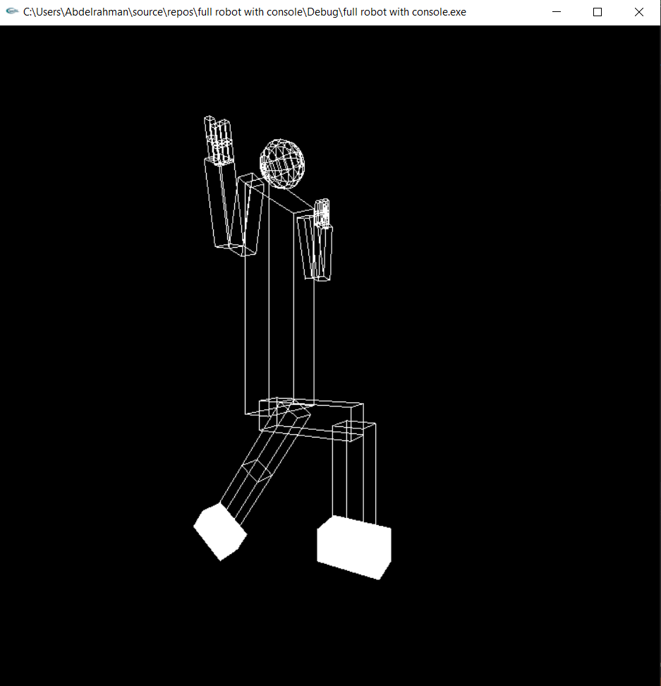

